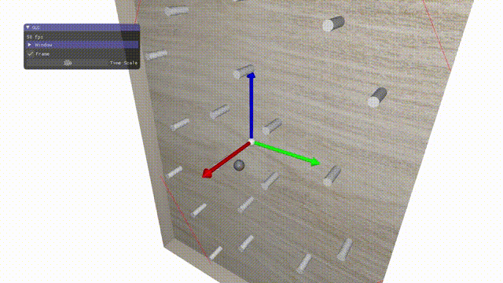

# Sphere Collision Simulation

## Description

This project is a simple simulation of collision for INF585--Computer Animation Course. It focus on the collision process between rigid sphere and rigid cylinder, and also elastic rope. It is build base on the lab code base, so it should run successfully under the lab code directory.

## Running

### Requirement

The project build on [CGP - Computer Graphics Programming Library](https://github.com/drohmer/CGP).

More details are provided in the dedicated [Installation setup and Compilation page](https://imagecomputing.net/cgp/compilation) if needed (Windows, Linux, Mac).

### Location

Project directory should be in the same directory of CGP library.

    your_directory_name/
    │
    ├── cgp/
    │
    └── sphere_collision_simulation/

### Compilation

Compilation via CMake
```
cd inf585_lab_code/scenes_inf585/project/
mkdir build
cd build/
cmake ..
make -j8 # or any -jN, with N=$(nproc)
./project
```

## Result



